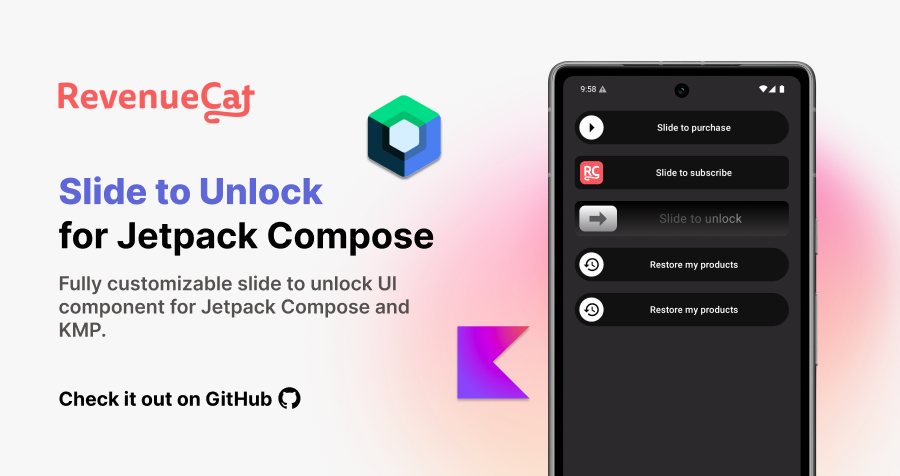

<a href="https://www.revenuecat.com/docs/getting-started/quickstart?utm_medium=organic&utm_source=github&utm_campaign=advocate"></a><br><br>

<p align="center">
  <a href="https://opensource.org/licenses/Apache-2.0"></a>
  <a href="https://android-arsenal.com/api?level=24"></a>
  <a href="https://github.com/revenuecat/slide-to-unlock/actions/workflows/android.yml"></a>
</p>

<p align="center">
➡️ Fully customizable slide to unlock UI component for Jetpack Compose and KMP.
</p><br>

## 📷 Previews

<p align="center">


</p>

<a href="https://www.revenuecat.com/docs/getting-started/quickstart?utm_medium=organic&utm_source=github&utm_campaign=advocate">

</a>

## Contribution 🧡
Slide to Unlock is maintained by [RevenueCat](https://www.revenuecat.com?utm_medium=organic&utm_source=github&utm_campaign=advocate). [RevenueCat SDK for Android](https://www.revenuecat.com/docs/getting-started/installation/android?utm_medium=organic&utm_source=github&utm_campaign=advocate) allows you to implement in-app subscriptions and a paywall system on top of Google Play Billing. Also, anyone can contribute to improving code, docs, or something following our [Contributing Guideline](https://github.com/Revenuecat/slide-to-unblock/blob/main/CONTRIBUTING.md).

## Download
[](https://search.maven.org/search?q=g:%22com.revenuecat%22%20AND%20a:%22slidetounlock%22)

### Version Catalog

If you're using Version Catalog, you can configure the dependency by adding it to your `libs.versions.toml` file as follows:

```toml
[versions]
#...
slidetounlock = "1.0.0"

[libraries]
#...
compose-slidetounlock = { module = "com.revenuecat.purchases:slidetounlock", version.ref = "slidetounlock" }
```

### Gradle

Add the dependency below to your **module**'s `build.gradle.kts` file:

```gradle
dependencies {
    implementation("com.revenuecat.purchases:slidetounlock:$version")
    
    // if you're using Version Catalog
    implementation(libs.compose.slidetounlock)
}
```

For Kotlin Multiplatform, add the dependency below to your **module**'s `build.gradle.kts` file:

```gradle
sourceSets {
    val commonMain by getting {
        dependencies {
            implementation(libs.compose.slidetounlock)
        }
    }
}
```

## Usage

You can easily implement a slide-to-unlock feature using the `SlideToUnlock` composable. It offers intuitive customization options for colors, text, shapes, and even the entire content of the thumb and hint, allowing you to create a wide variety of styles.

### Basic Usage

The `SlideToUnlock` composable exposes relevant state parameters, allowing you to hoist the slide status and track when the slide action is completed via a callback.

- `isSlided`: A `Boolean` state that controls the component's state. When `true`, the thumb moves to the end and becomes disabled.
- `onSlideCompleted`: A lambda that is invoked when the user successfully slides the thumb to the end. You should typically use this to update your `isSlided` state.

```kotlin
var isSlided by remember { mutableStateOf(false) }

SlideToUnlock(
    isSlided = isSlided,
    modifier = Modifier.fillMaxWidth(),
    onSlideCompleted = { isSlided = true },
)
```

### Customizing Colors

You can customize all colors of the component by leveraging an instance of `DefaultSlideToUnlockColors`, which contains some prebuilt behaviors for providing proper color sets depending on the states, and you can pass it to the `colors` parameter. This allows you to style the track, hint text, thumb, and progress indicator to match your app's theme.

```kotlin
var isSlided by remember { mutableStateOf(false) }

SlideToUnlock(
    isSlided = isSlided,
    modifier = Modifier
        .fillMaxWidth()
        .padding(16.dp),
    colors = DefaultSlideToUnlockColors(
        startTrackColor = Color.DarkGray,
        endTrackColor = Color(0xFF11D483), // A green color
        thumbColor = Color.White,
        slidedHintColor = Color.White,
    ),
    onSlideCompleted = { isSlided = true },
)
```

You can also provide a `Brush` for the track background for more advanced gradient effects.

```kotlin
val colorStops = arrayOf(
    0.0f to Color.Black,
    1f to Color(0xDC393636),
)

SlideToUnlock(
    isSlided = isSlided,
    // ...
    colors = DefaultSlideToUnlockColors(
        trackBrush = Brush.verticalGradient(colorStops = colorStops),
        // ...
    ),
    onSlideCompleted = { isSlided = true },
)
```

With `DefaultSlideToUnlockColors`, you can customize the properties below:

* **startTrackColor**: The color of the track when the thumb is at the start.
* **endTrackColor**: The color of the track when the thumb is at the end.
* **trackBrush**: An optional brush for the track, which overrides color if non-null.
* **startHintColor**: The color of the hint text at the start of the swipe.
* **endHintColor**: The color of the hint text at the end of the swipe (usually transparent).
* **slidedHintColor**: The color of the hint text after the slide is completed.
* **thumbColor**: The solid background color of the thumb.
* **thumbIconColor**: The color of the icon displayed inside the thumb.
* **thumbBrush**: An optional brush for the thumb.
* **progressColor**: The color used for the circular progress indicator.

While `DefaultSlideToUnlockColors` offers a convenient way to set static and interpolated colors, you can achieve complete, dynamic control over the component's appearance by creating your own class that implements the `SlideToUnlockColors` interface.

For example, you can create your own color sets that awares Material theme color scheme:

```kotlin
@Stable
private class MaterialThemedSlideToUnlockColors : SlideToUnlockColors {

    @Composable
    override fun trackColor(slideFraction: Float): Color {
        // Linearly interpolate from the theme's surface color to the primary color.
        return lerp(
            start = MaterialTheme.colorScheme.surfaceVariant,
            stop = MaterialTheme.colorScheme.primary,
            fraction = (slideFraction / 0.85f).coerceIn(0f, 1f)
        )
    }

    @Composable
    override fun trackBrush(slideFraction: Float): Brush? = null

    @Composable
    override fun hintColor(slideFraction: Float): Color {
        // Fade out the text color from onSurfaceVariant to transparent.
        val startColor = MaterialTheme.colorScheme.onSurfaceVariant
        return lerp(
            start = startColor,
            stop = startColor.copy(alpha = 0f),
            fraction = (slideFraction / 0.45f).coerceIn(0f, 1f)
        )
    }

    @Composable
    override fun slidedHintColor(): Color {
        return MaterialTheme.colorScheme.onPrimary
    }

    @Composable
    override fun thumbColor(): Color {
        return MaterialTheme.colorScheme.onPrimary
    }

    @Composable
    override fun thumbBrush(slideFraction: Float): Brush?  = null

    @Composable
    override fun thumbIconColor(): Color {
        return MaterialTheme.colorScheme.primary
    }

    @Composable
    override fun progressColor(): Color {
        return MaterialTheme.colorScheme.onPrimary
    }
}
```

### Customizing Hint Texts

The text displayed in the track can be customized by passing a `HintTexts` object. This allows you to define different messages for the initial state and the final "slided" state.

```kotlin
var isSlided by remember { mutableStateOf(false) }

SlideToUnlock(
    isSlided = isSlided,
    modifier = Modifier
        .fillMaxWidth()
        .padding(16.dp),
    hintTexts = HintTexts(
        defaultText = "Slide to subscribe",
        slidedText = "Subscribing...",
    ),
    onSlideCompleted = { isSlided = true },
)
```

### Fully Customize `thumb` and `hint` Composables

For complete control over the appearance and behavior of the thumb and hint, you can provide your own composable lambdas to the `thumb` and `hint` parameters. These are **slot APIs** that allow you to replace the default implementations entirely.

#### Customizing the Thumb

The `thumb` slot provides you with the `isSlided` state, the current `slideFraction`, the `colors` object, and the `thumbSize`. You can use these to create dynamic and interactive thumbs.

This example replaces the default arrow icon with a rotating app icon and shows a success checkmark when completed.

```kotlin
var isSlided by remember { mutableStateOf(false) }
var isCompleted by remember { mutableStateOf(false) }

LaunchedEffect(isSlided) {
    if (isSlided) {
        delay(1500) // Simulate in-app purchases or any tasks
        isCompleted = true
    }
}

SlideToUnlock(
    isSlided = isSlided,
    // ...
    onSlideCompleted = { isSlided = true },
    thumb = { slided, fraction, colors, size ->
        Box(
            modifier = Modifier
                .size(size)
                .background(color = colors.thumbColor(), shape = CircleShape),
        ) {
            if (isCompleted) {
                Icon(
                    imageVector = Icons.Default.Done,
                    contentDescription = "Completed",
                    tint = Color(0xFF11D483), // Green for success
                )
            } else if (slided) {
                CircularProgressIndicator(
                    modifier = Modifier.padding(8.dp),
                    color = colors.progressColor(),
                    strokeWidth = 3.dp,
                )
            } else {
                Icon(
                    modifier = Modifier
                        .align(Alignment.Center)
                        .size(30.dp)
                        .rotate(fraction * -360), // Rotate the icon as the user slides
                    imageVector = Icons.Default.Restore,
                    tint = colors.thumbIconColor(),
                    contentDescription = "Slide to restore",
                )
            }
        }
    },
    // ...
)
```

#### Customizing the Hint

Similarly, the `hint` composable slot gives you full control over the content displayed in the track. You can add animations, different text styles, or even other components like progress indicators.

This example replaces the default text with a `Row` that includes a `CircularProgressIndicator` when the slide is completed.

```kotlin
SlideToUnlock(
    isSlided = isSlided,
    // ...
    onSlideCompleted = { isSlided = true },
    hint = { slided, fraction, hintTexts, colors, paddings ->
        AnimatedContent(
            modifier = Modifier.align(Alignment.Center),
            targetState = isSlided,
        ) { isSlidedTarget ->
            if (isSlidedTarget) {
                Row(
                    horizontalArrangement = Arrangement.Center,
                    verticalAlignment = Alignment.CenterVertically,
                ) {
                    CircularProgressIndicator(
                        modifier = Modifier.size(24.dp),
                        color = Color.White,
                        strokeWidth = 2.dp,
                    )
                    Text(
                        modifier = Modifier.padding(start = 8.dp),
                        text = hintTexts.slidedText,
                        color = colors.slidedHintColor(),
                        style = MaterialTheme.typography.titleMedium,
                    )
                }
            } else {
                Text(
                    text = hintTexts.defaultText,
                    color = colors.hintColor(fraction),
                    style = MaterialTheme.typography.titleMedium,
                )
            }
        }
    },
    // ...
)
```

### Tracking Slide Fraction Changes

If you need to react to the slide progress in real-time, you can use the `onSlideFractionChanged` callback. This lambda is invoked continuously as the user drags the thumb, providing a `Float` value from `0.0` (start) to `1.0` (end).

This is useful for creating complex animations synchronized with the slide gesture.

```kotlin
var slideProgress by remember { mutableFloatStateOf(0f) }

// You can use `slideProgress` to animate other elements on the screen.
Text(
    text = "Progress: ${(slideProgress * 100).toInt()}%",
    modifier = Modifier.alpha(slideProgress)
)

SlideToUnlock(
    isSlided = isSlided,
    modifier = Modifier
        .fillMaxWidth()
        .padding(16.dp),
    onSlideCompleted = { isSlided = true },
    onSlideFractionChanged = { fraction ->
        slideProgress = fraction
    }
)
```

<a href="https://www.revenuecat.com/docs/getting-started/installation/android?utm_medium=organic&utm_source=github&utm_campaign=advocate">

</a>

## RevenueCat Integration

[](https://search.maven.org/search?q=g:%22com.revenuecat%22%20AND%20a:%22slidetounlock%22)

Slide to Unlock supports integrating features with [RevenueCat SDK](https://www.revenuecat.com/docs/getting-started/installation/kotlin-multiplatform?utm_medium=organic&utm_source=github&utm_campaign=advocate) for your Android & Kotlin Multiplatform project, and you can simply implement "Slide to Purchases" or "Slide to Subscribe" it by adding the dependency below:

```toml
[versions]
#...
slidetounlockPurchases = "1.0.0"

[libraries]
#...
compose-slidetounlock-purchases = { module = "com.revenuecat.purchases:slidetounlock-purchases", version.ref = "slidetounlockPurchases" }
```

### Gradle

Add the dependency below to your **module**'s `build.gradle.kts` file:

```gradle
dependencies {
    implementation("com.revenuecat.purchases:slidetounlock-purchases:$version")
    
    // if you're using Version Catalog
    implementation(libs.compose.slidetounlock.purchases)
}
```

For Kotlin Multiplatform, add the dependency below to your **module**'s `build.gradle.kts` file:

```gradle
sourceSets {
    val commonMain by getting {
        dependencies {
            implementation(libs.compose.slidetounlock.purchases)
        }
    }
}
```

### SlideToPurchases for Jetpack Compose

It's very similar to use like `SlideToUnlock` composable function, but it contains a few more parameters as required to purchases in app product with RevenueCat SDK.

`SlideToPurchases` is a customizable Jetpack Compose component that provides a sleek "slide-to-unlock" UI to initiate in-app purchases through the RevenueCat SDK. It's designed to be a drop-in replacement for a traditional purchase button, offering a more engaging and intentional user experience.

The library provides a set of overloaded `SlideToPurchases` composables to handle various purchasing scenarios, including different product types, subscription upgrades, and promotional offers, all while abstracting away the underlying purchase logic.

### Expectation

- **Engaging UI:** A "slide-to-unlock" gesture provides a clear and deliberate user action for making a purchase. You can highlight hint text and add dynamic behavior to boost user engagement.
- **Seamless Integration:** Directly integrates with RevenueCat's `Purchases.sharedInstance.awaitPurchase` methods.
- **State Handling:** Automatically manages and reports the state of the purchase (`Loading`, `Success`, `Error`) through a simple callback.
- **Customizable:** Offers easy customization for colors and hint texts to match your app's branding.
- **Flexible:** Basicailly supports all purchases methods by `StoreProduct`, `Package`, `SubscriptionOption`, and with `PromotionalOffer`s and `WinBackOffer`s.

To get started, simply add the `SlideToPurchases` composable to your UI. The primary entry points require you to provide a purchaseable entity, such as a `Package` or a `StoreProduct`.

#### Basic Purchase with a `Package`

This is the most common use case. You fetch your offerings from RevenueCat and pass the desired `Package` to the composable. The component will handle the rest.

```kotlin
// inside your coroutine scope
val currentOffering = Purchases.sharedInstance.awaitOfferings().current
val monthlyPackage = currentOffering?.getPackage("monthly")

if (monthlyPackage != null) {
    var purchaseState by remember { mutableStateOf<PurchaseState?>(null) }

    SlideToPurchases(
        packageToPurchase = monthlyPackage,
        modifier = Modifier
            .fillMaxWidth()
            .padding(16.dp),
        onPurchaseStateChanged = { newPurchaseState ->
            purchaseState = newPurchaseState
            // Handle state changes, e.g., show a dialog on success/error
        }
    )

    // Optionally display the state
    when (val state = purchaseState) {
        is PurchaseState.Loading -> { /* Show a loading indicator */ }
        is PurchaseState.Success -> { /* Navigate to a success screen */ }
        is PurchaseState.Error -> { /* Show an error message */ }
        null -> { /* Initial state */ }
    }
}
```

The `onPurchaseStateChanged` callback is the primary way to react to the outcome of the purchase flow. It provides a `PurchaseState` sealed class, which can be one of three types:

-   `PurchaseState.Loading`: Triggered when the slide is completed and the purchase process begins.
-   `PurchaseState.Success`: Triggered when the purchase is successful. It contains the `SuccessfulPurchase` object from the RevenueCat SDK.
-   `PurchaseState.Error`: Triggered if the purchase fails or is cancelled by the user. It contains the `Exception`.

The `SlideToPurchases` composable is provided as a set of overloads, each tailored to a specific purchasing scenario.

#### Common Parameters

All `SlideToPurchases` overloads share a set of common parameters for customization and event handling:

-   `modifier: Modifier`: The `Modifier` to be applied to the component.
-   `colors: SlideToUnlockColors`: An object to customize the component's appearance. Use `DefaultSlideToUnlockColors()` to get started.
-   `hintTexts: HintTexts`: An object to customize the text displayed in the track. Use `HintTexts.defaultHintTexts()` for default values.
-   `onSlideCompleted: () -> Unit`: A callback invoked immediately when the user completes the slide gesture, right before the purchase flow is initiated.
-   `onPurchaseStateChanged: (PurchaseState) -> Unit`: A callback that receives updates on the state of the purchase operation.

#### Overloads

##### 1. Purchasing a `StoreProduct`

Use this overload for purchasing a standalone `StoreProduct`. For subscriptions on Google Play, you can also manage upgrades.

```kotlin
@Composable
fun SlideToPurchases(
    storeProduct: StoreProduct,
    // ... common and platform-specific parameters
)
```
-  `oldProductId: String?`: (Google Play only) The product ID of a subscription to upgrade from.
-  `replacementMode: GoogleReplacementMode`: (Google Play only) The proration mode for the upgrade.

##### 2. Purchasing a `Package`

This is the recommended approach when using RevenueCat's Offerings system.

```kotlin
@Composable
fun SlideToPurchases(
    packageToPurchase: Package,
    // ... common and platform-specific parameters
)
```

##### 3. Purchasing a `SubscriptionOption`

A Google Play-only overload for purchasing a specific subscription option, such as a particular plan and offer.

```kotlin
@Composable
fun SlideToPurchases(
    subscriptionOption: SubscriptionOption,
    // ... common and platform-specific parameters
)
```

##### 4. Purchasing with a `PromotionalOffer`

An App Store-only overload for applying a signed promotional offer to a purchase.

```kotlin
@Composable
fun SlideToPurchases(
    packageToPurchase: Package, // or storeProduct: StoreProduct
    promotionalOffer: PromotionalOffer,
    // ... common parameters
)
```

##### 5. Purchasing with a `WinBackOffer`

An iOS-only overload (requires iOS 18+) for applying a win-back offer to a lapsed subscription.

```kotlin
@Composable
fun SlideToPurchases(
    packageToPurchase: Package, // or storeProduct: StoreProduct
    winBackOffer: WinBackOffer,
    // ... common parameters
)
```

By providing these clear and distinct overloads, `SlideToPurchaces` simplifies the process of integrating a beautiful and functional purchase UI into your Jetpack Compose app, allowing you to focus on your app's core logic while providing a great user experience.

## Find this repository useful? 😻

Support it by joining __[stargazers](https://github.com/revenuecat/slide-to-unlock/stargazers)__ for this repository. :star: <br>
Also, __[follow the main contributor](https://github.com/skydoves)__ on GitHub for the next creations! 🤩

# License
```xml
Copyright (c) 2025 RevenueCat, Inc.

Licensed under the Apache License, Version 2.0 (the "License");
you may not use this file except in compliance with the License.
You may obtain a copy of the License at

   http://www.apache.org/licenses/LICENSE-2.0

Unless required by applicable law or agreed to in writing, software
distributed under the License is distributed on an "AS IS" BASIS,
WITHOUT WARRANTIES OR CONDITIONS OF ANY KIND, either express or implied.
See the License for the specific language governing permissions and
limitations under the License.
```
